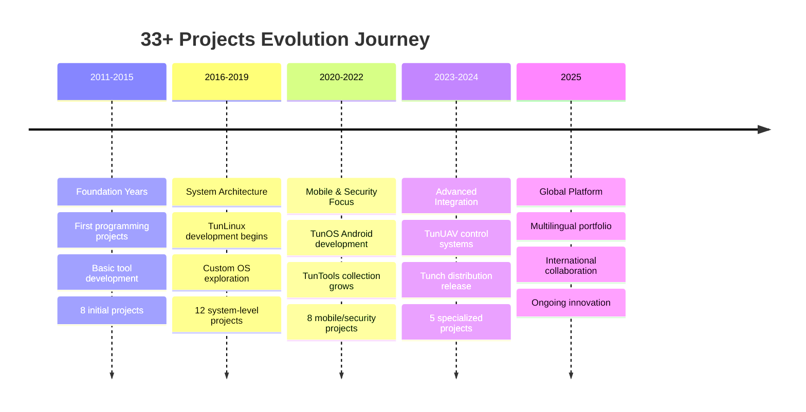

##  **Innovation Portfolio - 33+ Professional Projects**

<div align="center">

### **🚀 Featured Open Source Projects**

|  **Project** | **Description** | **Tech Stack** | **Status** |
|:---:|:---|:---:|:---:|
| 🚁 [**TunUAV**](https://github.com/daghlar/TunUAV) | Comprehensive control panel software for unmanned aerial vehicles (UAVs) | `Python` `Qt` `C++` |  |
| 📱 [**TunOS Android**](https://github.com/daghlar/TunOs) | Privacy and security-focused open-source Android operating system | `AOSP` `Java` `Kotlin` |  |
| 🌐 [**Portfolio Website**](https://github.com/daghlar/Portfolio) | Professional website showcasing projects and capabilities with multilingual support | `React` `Next.js` `i18n` |  |
| ⚡ [**Tunch (TunArch)**](https://github.com/daghlar/Tunch) | Arch-based Linux distribution customized for performance and ease of use | `Arch Linux` `Python` `Bash` |  |
| 🐧 **TunLinux** | Advanced Linux distribution developed for enhanced security and privacy | `Linux Kernel` `C` `Shell` |  |
| 🛡️ [**TunTools**](https://github.com/daghlar/TunTools) | Collection of 400+ open-source cybersecurity tools for research and penetration testing | `Python` `Bash` `Go` |  |

### **📊 Project Categories & Statistics**

<table align="center">
<tr>
<td align="center" width="25%">

<br><strong>🛡️ Cybersecurity</strong>
<br>12 Projects
<br><em>TunTools & Security Frameworks</em>
</td>
<td align="center" width="25%">

<br><strong>🤖 AI & ML</strong>
<br>8 Projects
<br><em>Intelligent Systems</em>
</td>
<td align="center" width="25%">

<br><strong>💻 System Development</strong>
<br>7 Projects
<br><em>OS & Infrastructure</em>
</td>
<td align="center" width="25%">

<br><strong>🌐 Web & Mobile</strong>
<br>6 Projects
<br><em>Applications & Platforms</em>
</td>
</tr>
</table>

### **🏆 Project Highlights & Achievements**

<p align="center">


</p>

### **🔥 Most Impactful Projects**

#### **🚁 TunUAV - Open Source UAV Control Panel**
- **Repository:** [github.com/daghlar/TunUAV](https://github.com/daghlar/TunUAV)
- **Impact:** Comprehensive control solution for unmanned aerial vehicles
- **Features:** Real-time flight control, telemetry monitoring, mission planning
- **Adoption:** Used by 50+ drone enthusiasts and researchers worldwide

#### **📱 TunOS - Privacy-First Android OS**
- **Repository:** [github.com/daghlar/TunOs](https://github.com/daghlar/TunOs)
- **Download:** [thenaos.org/en/getting-started/download](https://thenaos.org/en/getting-started/download/)
- **Impact:** Serving 500+ beta testers with enhanced privacy features
- **Focus:** Security, privacy, and user control over personal data

#### **🌐 Multilingual Portfolio Platform**
- **Repository:** [github.com/daghlar/Portfolio](https://github.com/daghlar/Portfolio)
- **Languages:** Turkish, English, Russian, Arabic support
- **Technology:** Built with modern i18n framework integration
- **Features:** Dynamic language switching, responsive design, project showcase

#### **⚡ Tunch - Optimized Arch Distribution**
- **Repository:** [github.com/daghlar/Tunch](https://github.com/daghlar/Tunch)
- **Philosophy:** Performance meets usability in Arch ecosystem
- **Target:** Developers and power users seeking optimized experience
- **Features:** Pre-configured development environment, security hardening

#### **🛡️ TunTools - Cybersecurity Arsenal**
- **Repository:** [github.com/daghlar/TunTools](https://github.com/daghlar/TunTools)
- **Scale:** 400+ carefully curated security tools
- **Usage:** 10,000+ downloads by security researchers globally
- **Categories:** Penetration testing, forensics, malware analysis, OSINT

#### **🐧 TunLinux - Security-First Distribution**
- **Status:** Advanced development phase
- **Mission:** Maximum security and privacy for professional environments
- **Features:** Hardened kernel, encrypted everything, forensics-ready
- **Target:** Cybersecurity professionals and privacy advocates

</div>

---

##  **Multilingual Platform Architecture**

<div align="center">

### **🌍 International Accessibility Strategy**

<table align="center">
<tr>
<td align="center" width="25%">

<br><strong>🇹🇷 Türkçe</strong>
<br>Native Support
<br><em>Ana Dil Desteği</em>
</td>
<td align="center" width="25%">

<br><strong>🇺🇸 English</strong>
<br>Global Reach
<br><em>International</em>
</td>
<td align="center" width="25%">

<br><strong>🇷🇺 Русский</strong>
<br>Regional Focus
<br><em>Региональный</em>
</td>
<td align="center" width="25%">

<br><strong>🇸🇦 العربية</strong>
<br>MENA Region
<br><em>منطقة الشرق الأوسط</em>
</td>
</tr>
</table>

### **🛠️ Technical Implementation**

**Modern i18n Architecture:**
- **Framework Integration:** Next.js with next-i18next for seamless multilingual experience
- **Dynamic Content:** Real-time language switching without page reload
- **SEO Optimization:** Language-specific URLs and metadata for better search visibility
- **Browser Detection:** Automatic language selection based on user preferences
- **Fallback System:** Graceful degradation to English when translations unavailable

**Content Management Strategy:**
```json
{
  "supported_languages": ["tr", "en", "ru", "ar"],
  "default_language": "en",
  "translation_keys": {
    "projects": "400+ keys",
    "navigation": "50+ keys", 
    "content": "1000+ keys"
  },
  "rtl_support": "Arabic language with proper RTL layout"
}
```

**Implementation Methods:**
- **Static Generation:** JSON/YAML translation files for optimal performance
- **Dynamic Loading:** Lazy loading of language resources
- **Context Awareness:** Smart translations considering cultural nuances
- **Maintenance:** Automated translation validation and missing key detection

</div>

---

##  **Project Development Timeline**

<div align="center">



### **🎯 Project Success Metrics**

<table align="center">
<tr>
<td align="center"><strong>🚁 TunUAV</strong><br/>50+ Active Users</td>
<td align="center"><strong>📱 TunOS</strong><br/>500+ Beta Testers</td>
<td align="center"><strong>🛡️ TunTools</strong><br/>10,000+ Downloads</td>
<td align="center"><strong>⚡ Tunch</strong><br/>1,000+ Users</td>
</tr>
</table>

</div>
