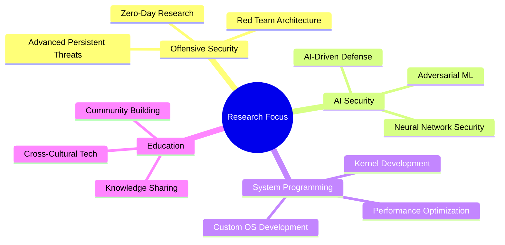

# Hi there, I'm Daghlar Mammadov 👋

<div align="center">
  


[](https://github.com/daghlar)
[](https://github.com/daghlar)

</div>

---

## 🚀 About Me

> **Computer Engineering Student** at Nişantaşı University with **13+ years** of hands-on experience in cybersecurity, AI research, and system engineering. Based in Istanbul, Turkey 🇹🇷

- 🔐 **Red Team Operations** & Advanced Penetration Testing
- 🤖 **AI/ML Research** with focus on Adversarial Security
- ⚙️ **System Engineering** & Kernel Development
- 🌐 **Full Stack Development** & DevSecOps
- 👥 **Community Leadership** & Technical Education
- 📚 Currently pursuing **OSCP** certification

---

## 🛡️ Core Expertise

<table>
<tr>
<td width="50%">

### 🔴 Red Team & Cybersecurity
```bash
├── Advanced Penetration Testing
├── Exploit Development & Research
├── Adversary Emulation (MITRE ATT&CK)
├── OSINT & Threat Intelligence
├── Security Automation & IR
└── Custom Security Tooling
```

### 🧠 AI & Machine Learning
```python
├── Neural Networks & Deep Learning
├── Adversarial ML & AI Security
├── TensorFlow & PyTorch
├── Model Optimization & Deployment
├── Computer Vision & NLP
└── MLOps & AI Infrastructure
```

</td>
<td width="50%">

### ⚙️ System Engineering
```c
├── Operating System Development
├── Kernel Programming & Drivers
├── Performance Optimization
├── Custom Browser Development
├── Linux/Unix Systems
└── Low-Level Programming
```

### 🌐 Full Stack & DevOps
```javascript
├── React, Next.js, TailwindCSS
├── Node.js & API Development
├── PostgreSQL, MongoDB
├── Docker & Kubernetes
├── CI/CD & GitOps
└── Infrastructure as Code
```

</td>
</tr>
</table>

---

## 📊 GitHub Statistics

<div align="center">
  
  
</div>

<div align="center">
  
</div>

---

## 🏆 Achievements & Certifications

<div align="center">

[](https://github.com/daghlar)

</div>

### 📜 Current Certifications
- 🎯 **OSCP** - Offensive Security Certified Professional *(In Progress)*
- 🌐 **Practical Web Application Security** - TunAcademy
- 🔴 **Advanced Red Team Infrastructure** - Internal Training
- 🤖 **AI Security & Adversarial ML** - Research-Based
- 🐧 **Linux Kernel Internals** - TunLabs Series

---

## 💻 Tech Stack

<div align="center">

### Programming Languages


### Frameworks & Libraries


### Tools & Platforms


</div>

---

## 🌍 Languages

<div align="center">

| Language | Level | Flag |
|----------|-------|------|
| **Azerbaijani** | Native | 🇦🇿 |
| **Turkish** | Fluent | 🇹🇷 |
| **English** | Professional | 🇺🇸 |
| **Russian** | Upper-Intermediate | 🇷🇺 |
| **Arabic** | Learning | 🇸🇦 |
| **Chinese** | Learning | 🇨🇳 |
| **Hebrew** | Learning | 🇮🇱 |
| **Persian** | Learning | 🇮🇷 |
| **Kurdish** | Learning | 🏴 |

</div>

---

## 🤝 Leadership & Community

<div align="center">
  
### 🏛️ Organizations I Lead

<table>
<tr>
<td align="center" width="50%">

**🛡️ Siber Tun Club**  
*President*

Leading cybersecurity workshops, OSINT research, and community mentorship programs

</td>
<td align="center" width="50%">

**🎙️ TUNTALKS.COM**  
*Founder*

Building a dynamic platform for technical knowledge sharing and cybersecurity education

</td>
</tr>
</table>

</div>

---

## 🔬 Research Interests

<div align="center">



</div>

---

## 📈 Contribution Graph

<div align="center">
  
</div>

---

## 🌐 Connect With Me

<div align="center">

### 📧 Secure Communication
[](mailto:daghlarmammadov@proton.me)
[](mailto:daghlarmammadov@tutanota.de)
[](https://matrix.to/#/@daghlar:matrix.org)

### 🌍 Professional Networks
[](https://daghlar.me)
[](https://tuntalks.com)
[](https://preprod.kureansiklopedi.org/en/profil/daghlar)

### 🎥 Content Creation
[](https://www.youtube.com/@Daghlar)
[](https://www.twitch.tv/daghlar)
[](https://odysee.com/@daghlar:6)

### 🐘 Decentralized Platforms
[](https://mastodon.social/@daghlar)
[](https://bsky.app/profile/daghlar.bsky.social)
[](https://pixelfed.social/daghlar)

### 📱 Social Media
[](https://twitter.com/xdaghlar)
[](https://instagram.com/xdaghlar)
[](https://t.me/daghlar)
[](https://www.reddit.com/user/xDaghlar)

</div>

---

<div align="center">

### 🎯 Mission Statement

*"Building bridges between cybersecurity, artificial intelligence, and community education to create a safer, more innovative digital future for everyone."*

---

**🔄 Profile last updated:** *July 31, 2025*


⭐ **If you find my work interesting, consider giving it a star!**

</div>
