```mermaid
timeline
    title Daghlar's Innovation Journey
    2011 : Programming Genesis
         : Started coding at age 10
         : First software projects
    2015 : AI Exploration
         : Machine learning basics
         : First AI models
    2018 : Cybersecurity Focus
         : Security research
         : OSINT techniques
    2021 : System Architecture
         : Custom OS development
         : Browser engineering
    2023 : University & Leadership
         : Nişantaşı University
         : Siber TUN President
    2024 : Community Building
         : TunTalks.com launch
         : Educational initiatives
    2025 : Global Impact
         : International projects
         : Cross-cultural tech bridge
```

#  Welcome to Daghlar's Digital Universe

<div align="center">
  
<!-- HERO BANNER WITH MATRIX EFFECT -->


<!-- DYNAMIC TYPING ANIMATION -->


<!-- PROFILE STATS -->
<p align="center">
  
  
  
  
</p>

<!-- PRIMARY SOCIAL BADGES -->
<p align="center">
  <a href="https://linkedin.com/in/xdaghlar">
    
  </a>
  <a href="https://t.me/daghlar">
    
  </a>
  <a href="https://x.com/xdaghlar">
    
  </a>
  <a href="https://www.youtube.com/@Daghlar">
    
  </a>
</p>

<!-- SECONDARY SOCIAL LINKS -->
<p align="center">
  <a href="https://www.instagram.com/@xdaghlar">
    
  </a>
  <a href="https://www.tiktok.com/@xdaghlar">
    
  </a>
  <a href="https://bsky.app/profile/daghlar.bsky.social">
    
  </a>
  <a href="https://www.reddit.com/user/xDaghlar/">
    
  </a>
  <a href="https://medium.com/@daghlar">
    
  </a>
</p>

<!-- EDUCATION & PROFESSIONAL PLATFORMS -->
<p align="center">
  <a href="https://teknofest.org/profile/xdaghlar">
    
  </a>
  <a href="https://udemy.com/user/tunacademy">
    
  </a>
  <a href="https://kick.com/xdaghlar">
    
  </a>
</p>

<!-- EMAIL & SECURE COMMUNICATION -->
<p align="center">
  <strong>📧 Contact & Secure Communication:</strong><br/>
  
  
  
</p>

<!-- PRIVACY-FOCUSED COMMUNICATION -->
<p align="center">
  <strong>🔐 Encrypted Channels:</strong><br/>
  
  
  
</p>

<!-- ADDITIONAL PROFILE LINKS -->
<p align="center">
  <a href="https://preprod.kureansiklopedi.com/en/profil/daghlar">
    
  </a>
  <a href="https://sosyal.teknofest.app/@daghlarmammadov">
    
  </a>
  <a href="https://odysee.com/@xdaghlar">
    
  </a>
  <a href="https://rutube.ru/channel/xdaghlar">
    
  </a>
  <a href="https://pixelfed.social/@xdaghlar">
    
  </a>
</p>

<!-- VISITOR COUNTER WITH ANIMATION -->


</div>

---

##  **About The Tech Visionary**

```python
class DaghlarMammadov:
    def __init__(self):
        self.name = "Daghlar Mammadov"
        self.origin = "🇦🇿 Azerbaijan"
        self.location = "🇹🇷 Istanbul, Turkey"
        self.age = 23
        self.experience = "13 years of continuous innovation"
        self.education = "Computer Engineering @ Nişantaşı University (2nd Year)"
        
        self.expertise = {
            "ai_ml": ["Machine Learning", "Deep Learning", "AI Model Development"],
            "cybersecurity": ["AppSec", "Network Security", "OSINT", "Penetration Testing"],
            "development": ["Full Stack", "System Architecture", "Open Source Projects"],
            "leadership": ["Siber TUN Club President", "Community Building", "Education"]
        }
        
        self.languages = {
            "native": ["Azerbaijani"],
            "fluent": ["Turkish"],
            "advanced": ["Russian"],
            "intermediate": ["English"],
            "learning": ["Arabic", "Chinese", "Hebrew", "Persian", "Kurdish", "Others"]
        }
        
        self.achievements = [
            "🏆 13 years of software development expertise",
            "🤖 Multiple AI models and systems developed",
            "🌐 Custom operating systems and browsers created",
            "👨‍🏫 Leading cybersecurity education at Siber TUN",
            "🗣️ Polyglot mastering 10+ languages"
        ]
    
    def current_mission(self):
        return "Bridging cultures through technology while securing the digital world"
        
    def daily_routine(self):
        return "🌅 Code → 🧠 AI Research → 🛡️ Security Labs → 🎓 Education → 🌍 Community"
```

<div align="center">

###  **Impact & Leadership**

<table>
<tr>
<td align="center" width="25%">
 
<br><strong>🏛️ Siber TUN</strong>
<br>Club President
<br><em>Leading Cybersecurity Education</em>
</td>
<td align="center" width="25%">

<br><strong>💬 TunTalks.com</strong>
<br>Forum Founder
<br><em>Building Tech Community</em>
</td>
<td align="center" width="25%">

<br><strong>🤖 AI Innovation</strong>
<br>Model Developer
<br><em>Cutting-edge Solutions</em>
</td>
<td align="center" width="25%">

<br><strong>🌍 Cultural Bridge</strong>
<br>Polyglot
<br><em>10+ Languages</em>
</td>
</tr>
</table>

</div>

---

##  **Technical Arsenal & Mastery**

<div align="center">

### **🎨 Frontend Development**


### **⚙️ Backend & Database**


### **🤖 AI & Programming Languages**


### **🛡️ Cybersecurity & System Administration**


### **🎨 Design & Tools**


</div>

---

##  **Technical Expertise Dashboard**

<div align="center">

### **📊 13 Years of Development Experience**

<table align="center">
<tr>
<td align="center" width="50%">

<br><strong>💻 Active Development</strong>
<br>📅 <strong>13 Years</strong> of Coding
<br>🏆 <strong>100+</strong> Projects Completed
<br>🌟 <strong>Open Source</strong> Contributor
</td>
<td align="center" width="50%">

<br><strong>🤖 AI & Security Focus</strong>
<br>🛡️ <strong>Cybersecurity</strong> Expert
<br>🧠 <strong>AI/ML</strong> Specialist
<br>🔍 <strong>OSINT</strong> Professional
</td>
</tr>
</table>

### **🛠️ Technical Stack Proficiency**

<table align="center">
<tr>
<td><strong>Frontend</strong></td>
<td></td>
<td>HTML, CSS, React, Next.js, TypeScript</td>
</tr>
<tr>
<td><strong>Backend</strong></td>
<td></td>
<td>Node.js, Python, Go, Rust, C++</td>
</tr>
<tr>
<td><strong>AI/ML</strong></td>
<td></td>
<td>TensorFlow, PyTorch, Custom Models</td>
</tr>
<tr>
<td><strong>Cybersecurity</strong></td>
<td></td>
<td>OSINT, AppSec, Network Security</td>
</tr>
<tr>
<td><strong>System Admin</strong></td>
<td></td>
<td>Linux/Unix, Docker, Cloud Platforms</td>
</tr>
</table>

### **🎯 Achievement Highlights**

<p align="center">


</p>

</div>

---

##  **Innovation Portfolio**

<div align="center">

|  **Project** | **Description** | **Tech Stack** | **Impact** |
|:---:|:---|:---:|:---:|
| 🤖 [**AI-Guardian**](https://github.com/daghlar/ai-guardian) | Advanced AI-powered cybersecurity defense system | `Python` `TensorFlow` `Go` |  |
| 🌠[**DaghOS**](https://github.com/daghlar/daghos) | Custom operating system with enhanced security features | `C++` `Assembly` `Rust` |  |
| 🔠[**OSINT-Master**](https://github.com/daghlar/osint-master) | Multi-language OSINT framework for global investigations | `Python` `JavaScript` `Docker` |  |
| 🛡️ [**SecureBrowser**](https://github.com/daghlar/secure-browser) | Privacy-focused browser with AI-powered threat detection | `JavaScript` `Electron` `Python` |  |
| 📠[**EduCyber-Platform**](https://github.com/daghlar/educyber) | Cybersecurity education platform for Siber TUN | `React` `Node.js` `PostgreSQL` |  |

</div>

---

##  **Language Mastery & Cultural Connection**

<div align="center">

### **🗣️ Linguistic Capabilities**

```mermaid
graph TD
    A[🇦🇿 Azerbaijani - Native] --> B[🇹🇷 Turkish - Fluent]
    B --> C[🇷🇺 Russian - Advanced]
    C --> D[🇺🇸 English - Intermediate]
    D --> E[🇸🇦 Arabic - Learning]
    E --> F[🇨🇳 Chinese - Learning]
    F --> G[🇮🇱 Hebrew - Learning]
    G --> H[🇮🇷 Persian - Learning]
    H --> I[🌍 Kurdish & Others - Learning]
```



**Cultural Bridge Philosophy:** *"Technology knows no borders, and neither should knowledge. Every language learned is a new door to innovation and understanding."*

</div>

---

##  **Community Leadership & Education**

<div align="center">

### **🏛️ Siber TUN - Cybersecurity Excellence**


**Leadership Responsibilities:**
- 🎯 **Event Organization** - Coordinating cybersecurity workshops and competitions
- 🔬 **Lab Platform Development** - Building hands-on learning environments
- 📚 **Content Creation** - Developing educational materials and curricula
- 🎓 **Educational Processes** - Mentoring students and professionals
- 🤝 **Community Building** - Fostering innovation and knowledge sharing

### **💬 TunTalks.com - Knowledge Hub**


*"A platform where technology enthusiasts from all backgrounds come together to share knowledge, discuss innovations, and build the future."*

</div>

---

##  **13 Years Journey Timeline**

<div align="center">



</div>

---

##  **2025 Vision & Goals**

<div align="center">

### **🎯 Strategic Objectives**

| **Domain** | **Goal** | **Timeline** | **Impact** |
|:---:|:---|:---:|:---:|
| 🤖 **AI Innovation** | Launch revolutionary AI security platform | Q2 2025 | Global cybersecurity enhancement |
| 🎓 **Education** | Expand Siber TUN to 1000+ members | Q3 2025 | Massive skill development |
| 🌍 **Global Reach** | Establish international tech partnerships | Q4 2025 | Cross-cultural innovation |
| 📚 **Knowledge** | Master 3 new programming languages | Ongoing | Technical excellence |
| 🗣️ **Languages** | Achieve fluency in Chinese and Arabic | 2025 | Cultural bridge building |

### **🚀 Mission Statement**
*"To bridge cultures through technology, secure the digital world through innovation, and educate the next generation of cyber defenders."*

</div>

---

##  **Connect Across All Platforms**

<div align="center">

### **🤝 Let's Build the Future Together!**


### **🌐 Find Me Everywhere**

<table align="center">
<tr>
<td><strong>🎥 Content Creation</strong></td>
<td><strong>💬 Social Networks</strong></td>
<td><strong>🔐 Secure Communication</strong></td>
</tr>
<tr>
<td>
• <a href="https://www.youtube.com/@Daghlar">YouTube</a> - Tech tutorials & insights<br/>
• <a href="https://www.tiktok.com/@xdaghlar">TikTok</a> - Quick cybersecurity tips<br/>
• <a href="https://kick.com/xdaghlar">Kick</a> - Live coding streams<br/>
• <a href="https://medium.com/@daghlar">Medium</a> - Technical articles<br/>
• <a href="https://odysee.com/@xdaghlar">Odysee</a> - Decentralized content<br/>
• <a href="https://rutube.ru/channel/xdaghlar">Rutube</a> - Russian audience
</td>
<td>
• <a href="https://x.com/xdaghlar">X (Twitter)</a> - Tech insights & news<br/>
• <a href="https://www.instagram.com/@xdaghlar">Instagram</a> - Behind the scenes<br/>
• <a href="https://bsky.app/profile/daghlar.bsky.social">Bluesky</a> - Decentralized social<br/>
• <a href="https://linkedin.com/in/xdaghlar">LinkedIn</a> - Professional network<br/>
• <a href="https://www.reddit.com/user/xDaghlar/">Reddit</a> - Community discussions<br/>
• <a href="https://pixelfed.social/@xdaghlar">Pixelfed</a> - Photo sharing
</td>
<td>
• <strong>ProtonMail:</strong> daghlarmammadov@proton.me<br/>
• <strong>Gmail:</strong> daghlarmammadov@gmail.com<br/>
• <strong>Tutanota:</strong> daghlarmammadov@tutanota.de<br/>
• <strong>QTox:</strong> xdaghlar@qtox.me<br/>
• <strong>Session:</strong> xdaghlar.session<br/>
• <strong>Element:</strong> @xdaghlar:matrix.org<br/>
• <a href="https://t.me/daghlar">Telegram</a> - @daghlar
</td>
</tr>
</table>

### **🏆 Professional & Educational Platforms**
- **🚀 Teknofest:** [Main Profile](https://teknofest.org/profile/xdaghlar) | [Social](https://sosyal.teknofest.app/@daghlarmammadov)
- **📚 Küre Ansiklopedi:** [Academic Profile](https://preprod.kureansiklopedi.com/en/profil/daghlar)
- **🎓 Udemy:** [TunAcademy](https://udemy.com/user/tunacademy) - Cybersecurity Courses

**Collaboration Interests:**
- 🤖 **AI-Powered Security Solutions** - Revolutionary defense systems
- 🌐 **Cross-Cultural Tech Projects** - Building bridges through code
- 🎓 **Educational Platform Development** - Empowering future cybersecurity experts
- 🔍 **Advanced OSINT Tools** - Multi-language intelligence gathering
- 🛡️ **Enterprise Security Consulting** - Protecting digital assets globally
- 📱 **Mobile Security Research** - Next-gen application protection

### **💬 Communication Preferences**

*Professional inquiries:* LinkedIn, ProtonMail, Gmail  
*Technical discussions:* X/Twitter, Bluesky, Medium, Reddit  
*Secure communications:* ProtonMail, Tutanota, QTox, Session, Element  
*Content collaboration:* YouTube, TikTok, Kick, Medium  
*Educational content:* Udemy (TunAcademy), YouTube, Medium  

*Available for conversations in:*
🇦🇿 Azerbaijani | 🇹🇷 Turkish | 🇷🇺 Russian | 🇺🇸 English

*Learning and practicing:*
🇸🇦 Arabic | 🇨🇳 Chinese | 🇮🇱 Hebrew | 🇮🇷 Persian | 🌍 Kurdish & More

</div>

---

<div align="center">

###  **"Innovation has no language barriers"**


### **⭐ "From Baku to Istanbul, from code to community - building tomorrow's digital world!"**


---

**💡 "13 years of experience, 10 languages learning, 1 mission: Making technology accessible to everyone, everywhere."**

</div>
