#  Welcome to Daghlar's Digital Universe

<div align="center">
  
<!-- HERO BANNER WITH MATRIX EFFECT -->


<!-- DYNAMIC TYPING ANIMATION -->


<!-- PROFILE STATS -->
<p align="center">
  
  
  
  
</p>

<!-- PRIMARY SOCIAL BADGES -->
<p align="center">
  <a href="https://linkedin.com/in/xdaghlar">
    
  </a>
  <a href="https://t.me/daghlar">
    
  </a>
  <a href="https://x.com/xdaghlar">
    
  </a>
  <a href="https://www.youtube.com/@Daghlar">
    
  </a>
</p>

<!-- SECONDARY SOCIAL LINKS -->
<p align="center">
  <a href="https://www.instagram.com/@xdaghlar">
    
  </a>
  <a href="https://www.tiktok.com/@xdaghlar">
    
  </a>
  <a href="https://bsky.app/profile/daghlar.bsky.social">
    
  </a>
  <a href="https://www.reddit.com/user/xDaghlar/">
    
  </a>
  <a href="https://medium.com/@daghlar">
    
  </a>
</p>

<!-- EDUCATION & PROFESSIONAL PLATFORMS -->
<p align="center">
  <a href="https://teknofest.org/profile/xdaghlar">
    
  </a>
  <a href="https://udemy.com/user/tunacademy">
    
  </a>
  <a href="https://kick.com/xdaghlar">
    
  </a>
</p>

<!-- EMAIL & SECURE COMMUNICATION -->
<p align="center">
  <strong>📧 Contact & Secure Communication:</strong><br/>
  
  
  
</p>

<!-- PRIVACY-FOCUSED COMMUNICATION -->
<p align="center">
  <strong>🔐 Encrypted Channels:</strong><br/>
  
  
  
</p>

<!-- ADDITIONAL PROFILE LINKS -->
<p align="center">
  <a href="https://preprod.kureansiklopedi.com/en/profil/daghlar">
    
  </a>
  <a href="https://sosyal.teknofest.app/@daghlarmammadov">
    
  </a>
  <a href="https://odysee.com/@xdaghlar">
    
  </a>
  <a href="https://rutube.ru/channel/xdaghlar">
    
  </a>
  <a href="https://pixelfed.social/@xdaghlar">
    
  </a>
</p>

<!-- VISITOR COUNTER WITH ANIMATION -->


</div>

---

##  **About The Tech Visionary**

```python
class DaghlarMammadov:
    def __init__(self):
        self.name = "Daghlar Mammadov"
        self.origin = "🇦🇿 Azerbaijan"
        self.location = "🇹🇷 Istanbul, Turkey"
        self.age = 23
        self.experience = "13 years of continuous innovation"
        self.education = "Computer Engineering @ Nişantaşı University (2nd Year)"
        
        self.expertise = {
            "ai_ml": ["Machine Learning", "Deep Learning", "AI Model Development"],
            "cybersecurity": ["AppSec", "Network Security", "OSINT", "Penetration Testing"],
            "development": ["Full Stack", "System Architecture", "Open Source Projects"],
            "leadership": ["Siber TUN Club President", "Community Building", "Education"]
        }
        
        self.languages = {
            "native": ["Azerbaijani"],
            "fluent": ["Turkish"],
            "advanced": ["Russian"],
            "intermediate": ["English"],
            "learning": ["Arabic", "Chinese", "Hebrew", "Persian", "Kurdish", "Others"]
        }
        
        self.achievements = [
            "🏆 13 years of software development expertise",
            "🤖 Multiple AI models and systems developed",
            "🌐 Custom operating systems and browsers created",
            "👨‍🏫 Leading cybersecurity education at Siber TUN",
            "🗣️ Polyglot mastering 10+ languages"
        ]
    
    def current_mission(self):
        return "Bridging cultures through technology while securing the digital world"
        
    def daily_routine(self):
        return "🌅 Code → 🧠 AI Research → 🛡️ Security Labs → 🎓 Education → 🌍 Community"
```

<div align="center">

###  **Impact & Leadership**

<table>
<tr>
<td align="center" width="25%">
 
<br><strong>🏛️ Siber TUN</strong>
<br>Club President
<br><em>Leading Cybersecurity Education</em>
</td>
<td align="center" width="25%">

<br><strong>💬 TunTalks.com</strong>
<br>Forum Founder
<br><em>Building Tech Community</em>
</td>
<td align="center" width="25%">

<br><strong>🤖 AI Innovation</strong>
<br>Model Developer
<br><em>Cutting-edge Solutions</em>
</td>
<td align="center" width="25%">

<br><strong>🌍 Cultural Bridge</strong>
<br>Polyglot
<br><em>10+ Languages</em>
</td>
</tr>
</table>

</div>

---

##  **Technical Arsenal & Mastery**

<div align="center">

### **🎨 Frontend Development**


### **⚙️ Backend & Database**


### **🤖 AI & Programming Languages**


### **🛡️ Cybersecurity & System Administration**


### **🎨 Design & Tools**


</div>

---

##  **Technical Expertise Dashboard**

<div align="center">

### **📊 13 Years of Development Experience**

<table align="center">
<tr>
<td align="center" width="50%">

<br><strong>💻 Active Development</strong>
<br>📅 <strong>13 Years</strong> of Coding
<br>🏆 <strong>100+</strong> Projects Completed
<br>🌟 <strong>Open Source</strong> Contributor
</td>
<td align="center" width="50%">

<br><strong>🤖 AI & Security Focus</strong>
<br>🛡️ <strong>Cybersecurity</strong> Expert
<br>🧠 <strong>AI/ML</strong> Specialist
<br>🔍 <strong>OSINT</strong> Professional
</td>
</tr>
</table>

### **🛠️ Technical Stack Proficiency**

<table align="center">
<tr>
<td><strong>Frontend</strong></td>
<td></td>
<td>HTML, CSS, React, Next.js, TypeScript</td>
</tr>
<tr>
<td><strong>Backend</strong></td>
<td></td>
<td>Node.js, Python, Go, Rust, C++</td>
</tr>
<tr>
<td><strong>AI/ML</strong></td>
<td></td>
<td>TensorFlow, PyTorch, Custom Models</td>
</tr>
<tr>
<td><strong>Cybersecurity</strong></td>
<td></td>
<td>OSINT, AppSec, Network Security</td>
</tr>
<tr>
<td><strong>System Admin</strong></td>
<td></td>
<td>Linux/Unix, Docker, Cloud Platforms</td>
</tr>
</table>

### **🎯 Achievement Highlights**

<p align="center">


</p>

</div>

---

##  **Innovation Portfolio - 33+ Professional Projects**

<div align="center">

### **🚀 Featured Open Source Projects**

|  **Project** | **Description** | **Tech Stack** | **Status** |
|:---:|:---|:---:|:---:|
| 🚠[**TunUAV**](https://github.com/daghlar/TunUAV) | Comprehensive control panel software for unmanned aerial vehicles (UAVs) | `Python` `Qt` `C++` |  |
| 📱 [**TunOS Android**](https://github.com/daghlar/TunOs) | Privacy and security-focused open-source Android operating system | `AOSP` `Java` `Kotlin` |  |
| 🌠[**Portfolio Website**](https://github.com/daghlar/Portfolio) | Professional website showcasing projects and capabilities with multilingual support | `React` `Next.js` `i18n` |  |
| ⚡ [**Tunch (TunArch)**](https://github.com/daghlar/Tunch) | Arch-based Linux distribution customized for performance and ease of use | `Arch Linux` `Python` `Bash` |  |
| 🧠**TunLinux** | Advanced Linux distribution developed for enhanced security and privacy | `Linux Kernel` `C` `Shell` |  |
| 🛡️ [**TunTools**](https://github.com/daghlar/TunTools) | Collection of 400+ open-source cybersecurity tools for research and penetration testing | `Python` `Bash` `Go` |  |

### **📊 Project Categories & Statistics**

<table align="center">
<tr>
<td align="center" width="25%">

<br><strong>🛡️ Cybersecurity</strong>
<br>12 Projects
<br><em>TunTools & Security Frameworks</em>
</td>
<td align="center" width="25%">

<br><strong>🤖 AI & ML</strong>
<br>8 Projects
<br><em>Intelligent Systems</em>
</td>
<td align="center" width="25%">

<br><strong>💻 System Development</strong>
<br>7 Projects
<br><em>OS & Infrastructure</em>
</td>
<td align="center" width="25%">

<br><strong>🌐 Web & Mobile</strong>
<br>6 Projects
<br><em>Applications & Platforms</em>
</td>
</tr>
</table>

### **🏆 Project Highlights & Achievements**

<p align="center">


</p>

### **🔥 Most Impactful Projects**

#### **🚁 TunUAV - Open Source UAV Control Panel**
- **Repository:** [github.com/daghlar/TunUAV](https://github.com/daghlar/TunUAV)
- **Impact:** Comprehensive control solution for unmanned aerial vehicles
- **Features:** Real-time flight control, telemetry monitoring, mission planning
- **Adoption:** Used by 50+ drone enthusiasts and researchers worldwide

#### **📱 TunOS - Privacy-First Android OS**
- **Repository:** [github.com/daghlar/TunOs](https://github.com/daghlar/TunOs)
- **Download:** [thenaos.org/en/getting-started/download](https://thenaos.org/en/getting-started/download/)
- **Impact:** Serving 500+ beta testers with enhanced privacy features
- **Focus:** Security, privacy, and user control over personal data

#### **🌐 Multilingual Portfolio Platform**
- **Repository:** [github.com/daghlar/Portfolio](https://github.com/daghlar/Portfolio)
- **Languages:** Turkish, English, Russian, Arabic support
- **Technology:** Built with modern i18n framework integration
- **Features:** Dynamic language switching, responsive design, project showcase

#### **⚡ Tunch - Optimized Arch Distribution**
- **Repository:** [github.com/daghlar/Tunch](https://github.com/daghlar/Tunch)
- **Philosophy:** Performance meets usability in Arch ecosystem
- **Target:** Developers and power users seeking optimized experience
- **Features:** Pre-configured development environment, security hardening

#### **🛡️ TunTools - Cybersecurity Arsenal**
- **Repository:** [github.com/daghlar/TunTools](https://github.com/daghlar/TunTools)
- **Scale:** 400+ carefully curated security tools
- **Usage:** 10,000+ downloads by security researchers globally
- **Categories:** Penetration testing, forensics, malware analysis, OSINT

#### **🐧 TunLinux - Security-First Distribution**
- **Status:** Advanced development phase
- **Mission:** Maximum security and privacy for professional environments
- **Features:** Hardened kernel, encrypted everything, forensics-ready
- **Target:** Cybersecurity professionals and privacy advocates

</div>

---

##  **Multilingual Platform Architecture**

<div align="center">

### **🌍 International Accessibility Strategy**

<table align="center">
<tr>
<td align="center" width="25%">

<br><strong>🇹🇷 Türkçe</strong>
<br>Native Support
<br><em>Ana Dil Desteği</em>
</td>
<td align="center" width="25%">

<br><strong>🇺🇸 English</strong>
<br>Global Reach
<br><em>International</em>
</td>
<td align="center" width="25%">

<br><strong>🇷🇺 Русский</strong>
<br>Regional Focus
<br><em>Региональный</em>
</td>
<td align="center" width="25%">

<br><strong>🇸🇦 العربية</strong>
<br>MENA Region
<br><em>منطقة الشرق الأوسط</em>
</td>
</tr>
</table>

### **🛠️ Technical Implementation**

**Modern i18n Architecture:**
- **Framework Integration:** Next.js with next-i18next for seamless multilingual experience
- **Dynamic Content:** Real-time language switching without page reload
- **SEO Optimization:** Language-specific URLs and metadata for better search visibility
- **Browser Detection:** Automatic language selection based on user preferences
- **Fallback System:** Graceful degradation to English when translations unavailable

**Content Management Strategy:**
```json
{
  "supported_languages": ["tr", "en", "ru", "ar"],
  "default_language": "en",
  "translation_keys": {
    "projects": "400+ keys",
    "navigation": "50+ keys", 
    "content": "1000+ keys"
  },
  "rtl_support": "Arabic language with proper RTL layout"
}
```

**Implementation Methods:**
- **Static Generation:** JSON/YAML translation files for optimal performance
- **Dynamic Loading:** Lazy loading of language resources
- **Context Awareness:** Smart translations considering cultural nuances
- **Maintenance:** Automated translation validation and missing key detection

</div>

---

##  **Project Development Timeline**

<div align="center">


### **🎯 Project Success Metrics**

<table align="center">
<tr>
<td align="center"><strong>🚁 TunUAV</strong><br/>50+ Active Users</td>
<td align="center"><strong>📱 TunOS</strong><br/>500+ Beta Testers</td>
<td align="center"><strong>🛡️ TunTools</strong><br/>10,000+ Downloads</td>
<td align="center"><strong>⚡ Tunch</strong><br/>1,000+ Users</td>
</tr>
</table>

</div>

---

##  **Language Mastery & Cultural Connection**

<div align="center">

### **🗣️ Linguistic Capabilities**

```mermaid
graph TD
    A[🇦🇿 Azerbaijani - Native] --> B[🇹🇷 Turkish - Fluent]
    B --> C[🇷🇺 Russian - Advanced]
    C --> D[🇺🇸 English - Intermediate]
    D --> E[🇸🇦 Arabic - Learning]
    E --> F[🇨🇳 Chinese - Learning]
    F --> G[🇮🇱 Hebrew - Learning]
    G --> H[🇮🇷 Persian - Learning]
    H --> I[🌍 Kurdish & Others - Learning]
```



**Cultural Bridge Philosophy:** *"Technology knows no borders, and neither should knowledge. Every language learned is a new door to innovation and understanding."*

</div>

---

##  **Community Leadership & Education**

<div align="center">

### **🏛️ Siber TUN - Cybersecurity Excellence**


**Leadership Responsibilities:**
- 🎯 **Event Organization** - Coordinating cybersecurity workshops and competitions
- 🔬 **Lab Platform Development** - Building hands-on learning environments
- 📚 **Content Creation** - Developing educational materials and curricula
- 🎓 **Educational Processes** - Mentoring students and professionals
- 🤝 **Community Building** - Fostering innovation and knowledge sharing

### **💬 TunTalks.com - Knowledge Hub**


*
