#  Welcome to Daghlar's Digital Fortress

<div align="center">
  
<!-- HERO BANNER WITH MATRIX EFFECT -->


<!-- DYNAMIC TYPING ANIMATION -->


<!-- GLOWING SOCIAL BADGES -->
<p align="center">
  <a href="https://linkedin.com/in/daghlar">
    
  </a>
  <a href="mailto:daghlar@protonmail.com">
    
  </a>
  <a href="https://twitter.com/daghlar_sec">
    
  </a>
  <a href="https://discord.gg/daghlar">
    
  </a>
</p>

<!-- VISITOR COUNTER WITH ANIMATION -->


</div>

---

##  **About The Digital Architect**

```python
class CyberSecuritySpecialist:
    def __init__(self):
        self.name = "Daghlar"
        self.role = "Cybersecurity Engineer & Ethical Hacker"
        self.code = ["Python", "Rust", "Go", "C++", "JavaScript", "Bash"]
        self.specialties = {
            "red_team": ["Penetration Testing", "Social Engineering", "Exploit Development"],
            "blue_team": ["Incident Response", "Digital Forensics", "Threat Hunting"],
            "osint": ["Information Gathering", "Social Media Analysis", "Deep Web Research"],
            "tools": ["Metasploit", "Burp Suite", "Nmap", "Wireshark", "Ghidra"]
        }
        
    def current_focus(self):
        return ["Advanced Persistent Threats", "Zero-Day Research", "AI Security"]
        
    def daily_routine(self):
        return "☕ Coffee → 🔍 Threat Intelligence → 💻 Code → 🛡️ Security Research"
```

<div align="center">

###  **Current Mission Status**

<table>
<tr>
<td align="center" width="33%">
 
<br><strong>Active Projects</strong>
<br>🔥 12 Repositories
</td>
<td align="center" width="33%">

<br><strong>CTF Victories</strong>
<br>🏆 8 Competitions Won
</td>
<td align="center" width="33%">

<br><strong>Community Impact</strong>
<br>👥 500+ Security Researchers
</td>
</tr>
</table>

</div>

---

##  **Tech Arsenal & Weaponry**

<div align="center">

### **🛡️ Cybersecurity Stack**


### **🔧 Development Tools** 


### **🌐 Web Technologies**


### **🗄️ Databases & Infrastructure**


</div>

---

##  **GitHub Analytics Dashboard**

<div align="center">
  


<!-- LANGUAGE STATS -->


</div>

---

##  **Featured Security Projects**

<div align="center">

|  **Project** | **Description** | **Tech Stack** | **Status** |
|:---:|:---|:---:|:---:|
| 🏴‍☠️ [**RedWolf-C2**](https://github.com/daghlar/redwolf-c2) | Advanced Command & Control Framework with AI-powered evasion | `Rust` `Python` `React` |  |
| 🔠[**OSINT-Hunter**](https://github.com/daghlar/osint-hunter) | Automated Open Source Intelligence Gathering Suite | `Python` `Go` `Docker` |  |
| 🛡️ [**SecureVault**](https://github.com/daghlar/securevault) | Zero-Knowledge Password Manager with Blockchain | `Rust` `WebAssembly` `Solidity` |  |
| 🔠[**CryptoShield**](https://github.com/daghlar/cryptoshield) | Military-grade Encryption Toolkit for Privacy | `C++` `Python` `OpenSSL` |  |
| 🌠[**WebRecon**](https://github.com/daghlar/webrecon) | Advanced Web Application Security Scanner | `Python` `JavaScript` `SQLite` |  |

</div>

---

##  **2025 Roadmap & Objectives**

<div align="center">



</div>

```mermaid
graph LR
    A[🎯 Q1 Goals] --> B[Zero-Day Research]
    A --> C[AI Security Framework]
    D[🚀 Q2 Goals] --> E[Open Source C2 Platform]
    D --> F[Cybersecurity Bootcamp]
    G[💎 Q3 Goals] --> H[Bug Bounty Hall of Fame]
    G --> I[Security Consulting Firm]
    J[🏆 Q4 Goals] --> K[International CTF Winner]
    J --> L[Security Conference Speaker]
```

**Milestone Tracker:**
- 🔥 **Build RedWolf-C2 Community** - Target: 1000+ security researchers
- 🎓 **Launch Cybersecurity Academy** - Free courses for ethical hackers
- 🏴‍☠️ **Win DEF CON CTF** - Ultimate hacker achievement
- 📚 **Publish Security Research** - 5+ whitepapers on advanced threats
- 🌍 **Global Security Impact** - Help secure 100+ organizations

---

##  **Certifications & Achievements**

<div align="center">

### **🏆 Professional Certifications**


### **🎯 CTF Achievements**
| Event | Rank | Year | Prize |
|:---:|:---:|:---:|:---:|
| 🏆 **HackTheBox University CTF** | 🥇 1st Place | 2024 | $5,000 |
| 🎯 **PicoCTF International** | 🥈 2nd Place | 2024 | $2,500 |
| 🔥 **CyberDefenders Challenge** | 🥉 3rd Place | 2023 | $1,000 |

</div>

---

##  **Knowledge Sharing & Community**

<div align="center">

### **📝 Recent Blog Posts**
- [🔐 **Advanced Persistence Techniques in Modern APTs**](https://daghlar.dev/blog/apt-persistence) - *2,500+ reads*
- [🏴‍☠️ **Building Undetectable C2 Infrastructure**](https://daghlar.dev/blog/c2-infrastructure) - *1,800+ reads*
- [🔍 **OSINT Mastery: From Beginner to Expert**](https://daghlar.dev/blog/osint-mastery) - *3,200+ reads*

### **🎥 YouTube Channel - "CyberSec with Daghlar"**


</div>

---

##  **Daily Motivation**

<div align="center">
  


### **🎯 Hacker's Mindset**
*"In a world of 1s and 0s, be the exception that breaks the pattern."*

</div>

---

##  **Connect & Collaborate**

<div align="center">

### **🤝 Let's Build Something Epic Together!**


**Areas of Interest:**
- 🔥 Red Team Operations & Advanced Persistent Threats
- 🛡️ Zero Trust Architecture Implementation  
- 🤖 AI-Powered Security Solutions
- 🌐 Web3 & Blockchain Security
- 📱 Mobile Application Security Testing

</div>

---

<div align="center">

###  **"Security is not a product, but a process"**


### **⭐ If you find my work valuable, consider starring my repositories!**


---

**💬 "The only way to truly secure something is to understand how it can be broken."**

</div>
