<div align="center">


[](https://github.com/daghlar)
[](https://github.com/daghlar)
[](https://github.com/daghlar)

</div>

---


##  **About Me**


```yaml
name: "Daghlar Mammadov"
role: "Cybersecurity Specialist & AI Researcher"
location: "Istanbul, Turkey 🇹🇷"
education: "Computer Engineering @ Nişantaşı University"
experience: "13+ Years in Cybersecurity & Technology"
current_focus: 
  - "🔴 Advanced Red Team Operations"
  - "🤖 AI Security & Adversarial ML"
  - "⚙️ Operating System Development" 
  - "🌐 Full Stack & DevSecOps"
  - "👥 Community Leadership"
certifications:
  - "OSCP (In Progress)"
  - "Practical Web App Security"
  - "Advanced Red Team Infrastructure"
  - "AI Security & Adversarial ML"
```

<details>
<summary><b>🎯 Mission Statement</b></summary>
<br>
<blockquote>
"Bridging the gap between offensive cybersecurity, artificial intelligence research, and community education to build a safer, more innovative digital ecosystem. Through hands-on research, technical leadership, and knowledge sharing, I aim to advance the field of cybersecurity while fostering the next generation of security professionals."
</blockquote>
</details>

---


##  **Technical Arsenal**

<div align="center">

### 🔴 **Red Team & Cybersecurity**


```bash
┌─[expertise@redteam]─[~/skills]
└──╼ $ cat red_team_capabilities.txt

├── 🎯 Advanced Penetration Testing & Exploit Development
├── 🕵️ OSINT & Social Engineering Techniques  
├── 🏴‍☠️ Adversary Emulation (MITRE ATT&CK Framework)
├── 🔍 Vulnerability Research & Zero-Day Discovery
├── 🛡️ Security Automation & Incident Response
├── 🔧 Custom Security Tooling & Framework Development
├── 📊 Threat Intelligence & Risk Assessment
└── 🚨 Red Team Infrastructure & C2 Operations
```

### 🤖 **AI & Machine Learning**


```python
# AI Security & Machine Learning Expertise
class AISecurityExpert:
    def __init__(self):
        self.specializations = {
            "adversarial_ml": ["Evasion Attacks", "Poisoning Attacks", "Model Stealing"],
            "deep_learning": ["CNNs", "RNNs", "GANs", "Transformers"],
            "ai_security": ["Model Hardening", "Robustness Testing", "Privacy"],
            "frameworks": ["TensorFlow", "PyTorch", "Scikit-learn", "OpenCV"],
            "domains": ["Computer Vision", "NLP", "Time Series", "Reinforcement Learning"]
        }
```

### ⚙️ **System Engineering & Low-Level**


```c
// System-Level Programming Expertise
#include <expertise.h>

typedef struct {
    char* os_development;      // "Custom OS & Kernel Programming"
    char* driver_dev;         // "Device Driver Development"  
    char* performance;        // "System Performance Optimization"
    char* browser_dev;        // "Custom Browser Engine Development"
    char* embedded;           // "Embedded Systems Programming"
    char* reverse_eng;        // "Reverse Engineering & Binary Analysis"
} SystemExpertise;
```

### 🌐 **Full Stack & DevSecOps**


```javascript
const fullStackExpertise = {
  frontend: {
    frameworks: ["React", "Next.js", "Vue.js"],
    styling: ["TailwindCSS", "Styled-Components", "SCSS"],
    tools: ["Webpack", "Vite", "TypeScript"]
  },
  backend: {
    runtime: ["Node.js", "Python", "Go", "Rust"],
    databases: ["PostgreSQL", "MongoDB", "Redis", "ClickHouse"],
    apis: ["REST", "GraphQL", "gRPC", "WebSockets"]
  },
  devops: {
    containers: ["Docker", "Kubernetes", "Podman"],
    ci_cd: ["GitHub Actions", "GitLab CI", "Jenkins"],
    infrastructure: ["Terraform", "Ansible", "AWS", "GCP"]
  }
};
```

</div>

---


##  **Featured Projects & Repositories**

<div align="center">

### 🔴 **Core Projects - Priority Focus**

<table>
<tr>
<td align="center" width="50%">
<a href="https://github.com/daghlar/TunLinux">

</a>
<br><br>
<b>An indispensable Linux distribution for daily use and cybersecurity</b>
<br><br>
<em>Minimal, customizable Linux distribution using runit or openrc as init system</em>
<br><br>
<a href="https://github.com/daghlar/TunLinux">

</a>
</td>
<td align="center" width="50%">
<a href="https://github.com/daghlar/tunos">

</a>
<br><br>
<b>Open Source Private and Security Android OS</b>
<br><br>
<em>Trusted Unified Network Operating System with advanced privacy controls</em>
<br><br>
<a href="https://github.com/daghlar/tunos">

</a>
</td>
</tr>
<tr>
<td align="center" width="50%">
<a href="https://github.com/daghlar/TunTools">

</a>
<br><br>
<b>Comprehensive cybersecurity and penetration testing tools</b>
<br><br>
<em>Advanced red team operations and security research utilities</em>
<br><br>
<a href="https://github.com/daghlar/TunTools">

</a>
</td>
<td align="center" width="50%">
<a href="https://github.com/daghlar/TunUV">

</a>
<br><br>
<b>Open Source Unmanned Aerial Vehicle Control Panel</b>
<br><br>
<em>Advanced drone control and automation systems</em>
<br><br>
<a href="https://github.com/daghlar/TunUV">

</a>
</td>
</tr>
</table>


</div>

---


##  **GitHub Analytics**

<div align="center">


</div>

<div align="center">

</div>

<div align="center">

</div>

---


##  **Technology Stack**

<div align="center">

### **Programming Languages**


### **AI/ML & Data Science**


### **Frontend Development**


### **Backend & Database**


### **DevOps & Infrastructure**


### **Security & Penetration Testing**


### **Operating Systems**


</div>

---


##  **Achievements & Certifications**

<div align="center">

[](https://github.com/daghlar)

</div>

### 🔴 **Ethical Hacking & Cybersecurity**
<table align="center">
<tr>
<td align="center" width="33%">

<br><b>CompTIA Ethical Hacker Pro</b>
</td>
<td align="center" width="33%">

<br><b>OPSWAT Ethical Hacker Expert</b>
</td>
<td align="center" width="33%">

<br><b>Cisco Ethical Hacker</b>
</td>
</tr>
</table>

### 🌐 **Networking & Infrastructure**
<table align="center">
<tr>
<td align="center" width="50%">

<br><b>Cisco CCNA</b>
</td>
<td align="center" width="50%">

<br><b>Linux Foundation Certified System Administrator</b>
</td>
</tr>
</table>

### ☁️ **Cloud Security & Management**
<table align="center">
<tr>
<td align="center" width="50%">

<br><b>Palo Alto Cloud Security Fundamentals</b>
</td>
<td align="center" width="50%">

<br><b>Fortinet FCP FortiManager 7.6 Administrator</b>
</td>
</tr>
</table>

### 🎯 **Specialized Training & Development**
<table align="center">
<tr>
<td align="center" width="50%">

<br><b>LetsDefend Programming for Cybersecurity</b>
</td>
<td align="center" width="50%">

<br><b>Cybrary Penetration Testing & Ethical Hacking</b>
</td>
</tr>
</table>


---


##  **Global Language Skills**

<div align="center">

<table>
<tr>
<th>🌍 Language</th>
<th>📊 Level</th>
<th>🎯 Proficiency</th>
<th>🏆 Status</th>
</tr>
<tr>
<td> <b>Azerbaijani</b></td>
<td></td>
<td>Native Speaker</td>
<td>🥇 Master</td>
</tr>
<tr>
<td> <b>Turkish</b></td>
<td></td>
<td>Fluent</td>
<td>🥇 Master</td>
</tr>
<tr>
<td> <b>English</b></td>
<td></td>
<td>Professional Working</td>
<td>🥈 Advanced</td>
</tr>
<tr>
<td> <b>Russian</b></td>
<td></td>
<td>Upper-Intermediate</td>
<td>🥈 Advanced</td>
</tr>
<tr>
<td> <b>Arabic</b></td>
<td></td>
<td>Learning</td>
<td>🥉 Beginner</td>
</tr>
<tr>
<td> <b>Chinese</b></td>
<td></td>
<td>Learning</td>
<td>🥉 Beginner</td>
</tr>
<tr>
<td> <b>Hebrew</b></td>
<td></td>
<td>Learning</td>
<td>🥉 Beginner</td>
</tr>
<tr>
<td> <b>Persian</b></td>
<td></td>
<td>Learning</td>
<td>🥉 Beginner</td>
</tr>
<tr>
<td>🏴 <b>Kurdish</b></td>
<td></td>
<td>Learning</td>
<td>🥉 Beginner</td>
</tr>
</table>

</div>

---


##  **Leadership & Community Impact**

<div align="center">

<table>
<tr>
<td align="center" width="50%">

<br><br>

<br><br>
<b>Leading cybersecurity workshops, OSINT research, and community mentorship programs</b>
<br><br>


</td>
<td align="center" width="50%">

<br><br>

<br><br>
<b>Building a dynamic platform for technical knowledge sharing and cybersecurity education</b>
<br><br>


</td>
</tr>
</table>

</div>

---


##  **Research & Innovation**

<div align="center">



</div>

```mermaid
mindmap
  root((🔬 Research Focus))
    🔴 Offensive Security
      Advanced Persistent Threats
      Zero-Day Research & Exploitation
      Red Team Infrastructure Design
      Post-Exploitation Techniques
    🤖 AI Security
      Adversarial Machine Learning
      Neural Network Robustness
      AI-Powered Threat Detection
      Privacy-Preserving ML
    ⚙️ System Programming
      Custom Operating Systems
      Kernel Security Mechanisms  
      Performance Optimization
      Browser Engine Development
    🌐 Educational Technology
      Cybersecurity Training Platforms
      Interactive Learning Systems
      Community-Driven Knowledge Sharing
      Cross-Cultural Tech Integration
```

### 🎯 **Current Research Projects**
- 🔴 **Advanced Red Team Automation Framework** - AI-powered attack simulation platform
- 🤖 **Adversarial ML Detection System** - Real-time detection of adversarial attacks on ML models
- ⚙️ **Secure Microkernel Architecture** - Custom OS kernel with built-in security features
- 🌐 **Decentralized Education Platform** - Blockchain-based certification and learning system

---


##  **Connect With Me**

<div align="center">

### 🔒 **Secure Communication**
[](mailto:daghlarmammadov@proton.me)
[](mailto:daghlarmammadov@tutanota.de)
[](mailto:daghlarmammadov@gmail.com)
[](https://matrix.to/#/@daghlar:matrix.org)

### 🌐 **Professional Networks**
[](https://daghlar.me)
[](https://tuntalks.com)
[](https://preprod.kureansiklopedi.org/en/profil/daghlar)
[](https://teknofest.org/profile/daghlarmammadov)

### 🎥 **Content Creation & Streaming**
[](https://www.youtube.com/@Daghlar)
[](https://www.twitch.tv/daghlar)
[](https://kick.com/daghlar)
[](https://rutube.ru/@daghlar)
[](https://odysee.com/@daghlar:6)

### 🐘 **Decentralized & Privacy-Focused Platforms**
[](https://mastodon.social/@daghlar)
[](https://bsky.app/profile/daghlar.bsky.social)
[](https://pixelfed.social/daghlar)

### 📱 **Social Media & Communication**
[](https://twitter.com/xdaghlar)
[](https://instagram.com/xdaghlar)
[](https://t.me/daghlar)
[](https://www.reddit.com/user/xDaghlar)
[](https://medium.com/@daghlar)

### 💼 **Professional Development**
[](https://linkedin.com/in/daghlarmammadov)
[](https://github.com/daghlar)
[](https://gitlab.com/daghlar)
[](https://stackoverflow.com/users/daghlar)

</div>

---


##  **Latest Activity & Contributions**

<div align="center">

### 📈 **Real-time GitHub Activity**
<!--START_SECTION:activity-->
<!--END_SECTION:activity-->

### 🔥 **Contribution Snake**
<picture>
  <source media="(prefers-color-scheme: dark)" srcset="https://raw.githubusercontent.com/daghlar/daghlar/output/github-contribution-grid-snake-dark.svg">
  <source media="(prefers-color-scheme: light)" srcset="https://raw.githubusercontent.com/daghlar/daghlar/output/github-contribution-grid-snake.svg">
  
</picture>

### 🎯 **WakaTime Coding Stats**
<!--START_SECTION:waka-->
<!--END_SECTION:waka-->

</div>

---


##  **Support My Work**

<div align="center">

### ☕ **Traditional Support Platforms**
[](https://ko-fi.com/daghlar)
[](https://www.buymeacoffee.com/daghlar)
[](https://patreon.com/daghlar)

### 🔐 **Cryptocurrency Donations**
<details>
<summary><b>💰 Wallet Addresses</b></summary>
<br>

```
🟠 Bitcoin (BTC)
bc1qxy2kgdygjrsqtzq2n0yrf2493p83kkfjhx0wlh

🔵 Ethereum (ETH)
0x742d35Cc6634C0532925a3b8D4B9CA07F6F4AF6A

🟡 Binance Smart Chain (BSC)
bnb136ns6lfw4zs5hg4n85vdthaad7hq5m4gtkgf23
```

</details>

### 🌐 **Supported Wallets**
- **MetaMask** - Browser Extension
- **Coinbase Wallet** - Mobile & Browser
- **Binance Wallet** - Multi-Chain Support
- **Trezor Suite** - Hardware Security
- **Onion Wallet** - Privacy Focused

### 🔒 **Security Notice**
> *All addresses are verified and secure. Never share your private keys.*

</div>

---


##  **Visitor Information**

<div align="center">


### 📊 **Visitor Stats**


### 🌍 **Global Reach**


</div>

---

<div align="center">


### 🎯 **Mission Statement**

> *"Bridging the gap between offensive cybersecurity, artificial intelligence research, and community education to build a safer, more innovative digital ecosystem. Through hands-on research, technical leadership, and knowledge sharing, I aim to advance the field of cybersecurity while fostering the next generation of security professionals worldwide."*

---


**Thanks for visiting my profile! Let's connect and build something amazing together.**

---

**🔄 Profile last updated:** *July 31, 2025*  
**⚡ Fun fact:** *I speak 9 languages and have been coding for over 13 years!*


</div>
